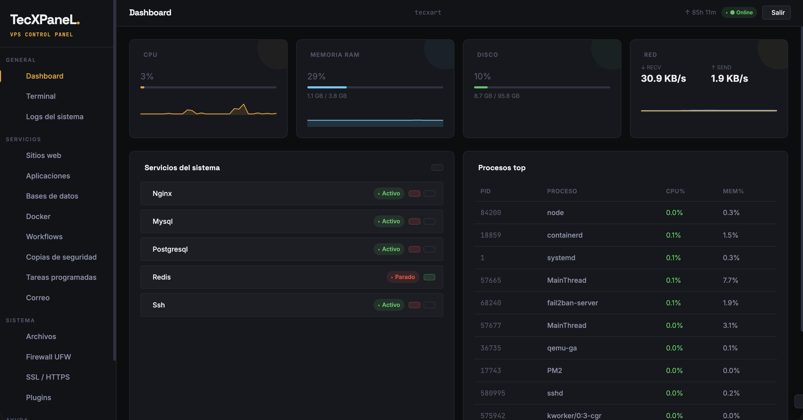
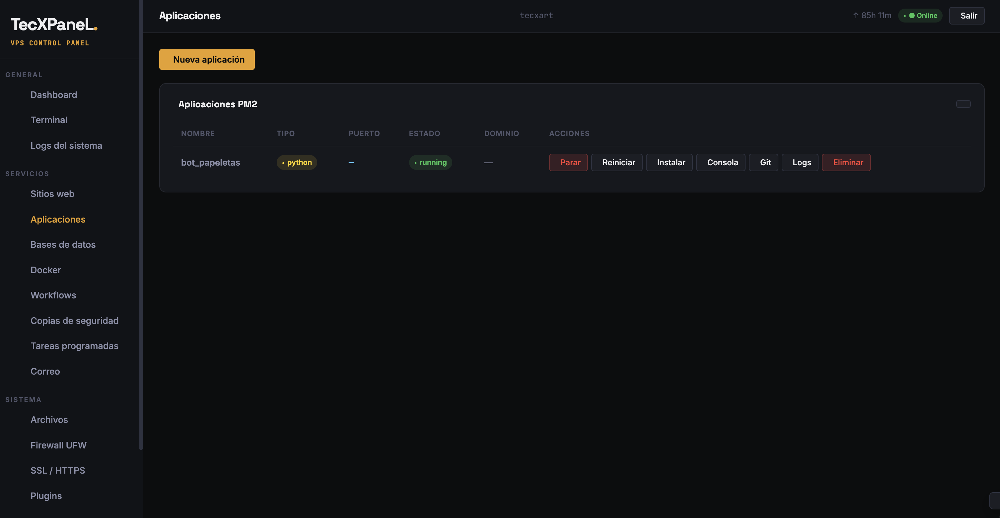
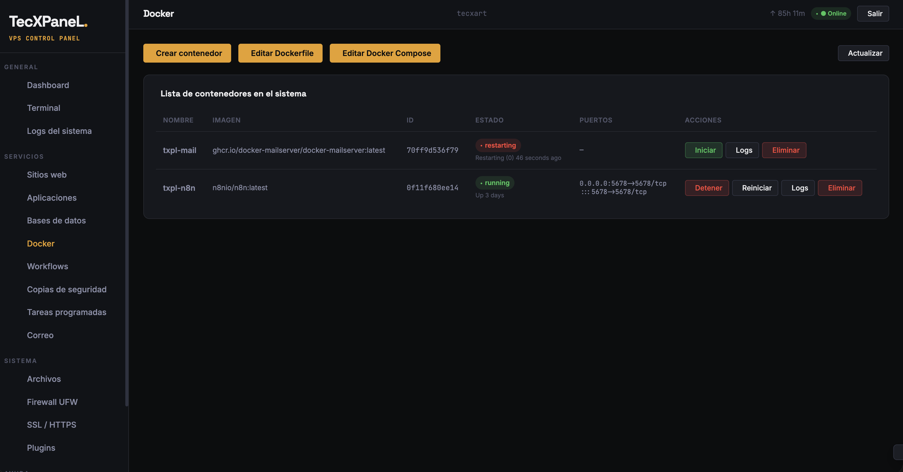
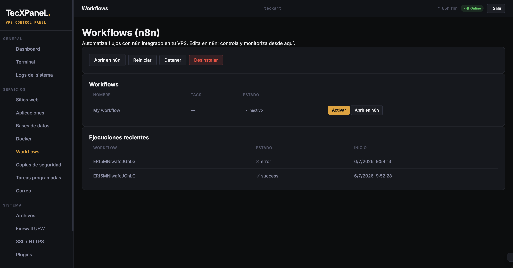
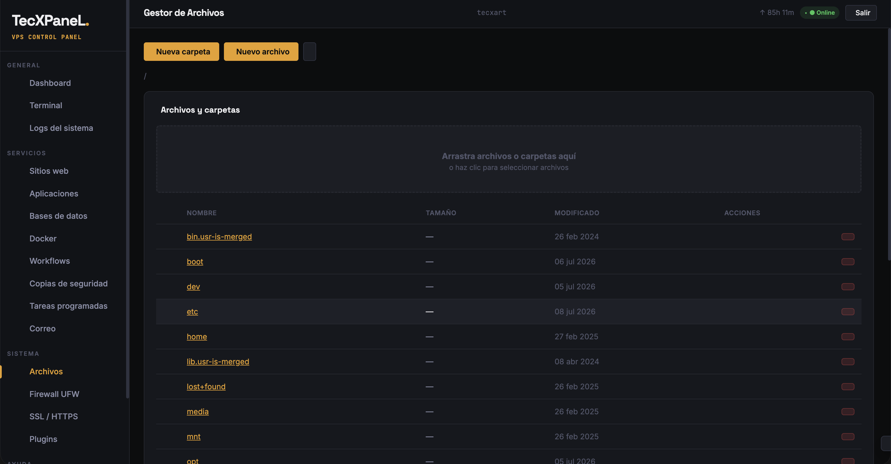
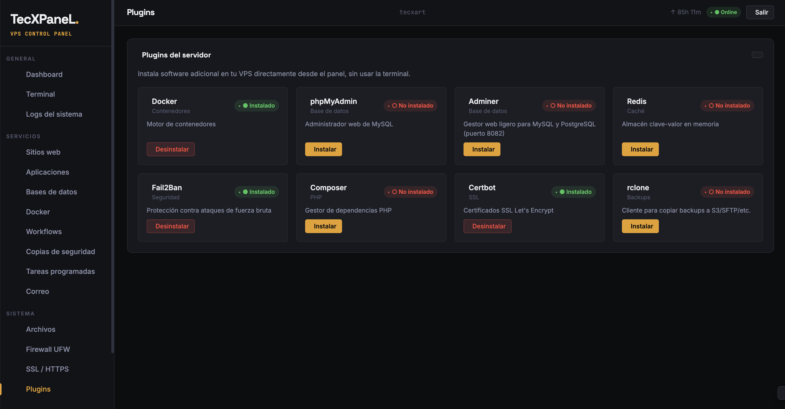

<p align="center">
  
</p>

# ⚡ TecXPaneL

<p align="center">
  
  
  
  
  
</p>

### Último commit


**TecXPaneL** es un panel de control autohospedado, moderno y extremadamente ligero diseñado para gestionar servidores VPS basados en **Ubuntu/Debian**. Ofrece una alternativa de alto rendimiento y bajo consumo a paneles pesados como cPanel o Plesk, consumiendo menos de **30 MB de RAM**.

Está desarrollado como una **SPA (Single Page Application)** modular en el frontend y un backend rápido en **Node.js** con base de datos **SQLite**.

---

## 🖼️ Vista previa

<table>
  <tr>
    <td width="50%"><p align="center"><sub><b>Dashboard</b> — CPU, RAM, disco y red en tiempo real, servicios y procesos top.</sub></p></td>
    <td width="50%"><p align="center"><sub><b>Aplicaciones</b> — despliegue y gestión de apps sobre PM2 (Node, Python, React…).</sub></p></td>
  </tr>
  <tr>
    <td width="50%"><p align="center"><sub><b>Docker</b> — contenedores, imágenes, puertos y logs sin usar la CLI.</sub></p></td>
    <td width="50%"><p align="center"><sub><b>Workflows (n8n)</b> — activa flujos y revisa las ejecuciones recientes.</sub></p></td>
  </tr>
  <tr>
    <td width="50%"><p align="center"><sub><b>Gestor de archivos</b> — navega, edita y sube archivos con drag-and-drop.</sub></p></td>
    <td width="50%"><p align="center"><sub><b>Plugins</b> — instala Docker, phpMyAdmin, Redis, Fail2Ban, rclone… en un clic.</sub></p></td>
  </tr>
</table>

---

## 🚀 Características Principales

- 🌐 **Sitios Web**: Despliegue de sitios estáticos HTML, PHP (con selector de versiones PHP-FPM), Node.js, React y Python configurados automáticamente con proxy inverso en Nginx.
- 📦 **Aplicaciones en un Clic**: Despliegue avanzado de aplicaciones Node.js, Python, React y TypeScript a través de PM2. Soporta carga en `.zip`/`.tar.gz` o **clonado desde Git con auto-deploy por webhook**, y gestión de archivos `.env`. En **Python** aísla cada app en su propio **virtualenv (`.venv`)** y distingue **servicio web** (con puerto y proxy) de **worker/bot** (sin puerto, p. ej. un bot de Telegram), con comando de arranque editable.
- 🎁 **Catálogo de aplicaciones**: Instala WordPress, Ghost, Nextcloud, Vaultwarden y Uptime Kuma con un clic, en Docker, nativo (PHP-FPM) o PM2 según prefieras, con dominio + SSL opcionales y base de datos gestionada.
- 🐘 **Bases de Datos**: Creación instantánea de bases de datos MySQL (MariaDB) y PostgreSQL. Autogeneración de contraseñas seguras cifradas en reposo (AES-256-GCM).
- 🔒 **SSL Automático**: Instalación y renovación automática de certificados SSL gratuitos de **Let's Encrypt** mediante Certbot con redirección HTTPS forzada.
- 🛡️ **Firewall & Seguridad**: Gestión de reglas de firewall **UFW** desde el panel. Autenticación **JWT** con expiración corta, bloqueo temporal de IPs por fuerza bruta e integración nativa de **2FA (TOTP)**.
- 📟 **Terminal SSH Integrada**: Consola interactiva en tiempo real directamente en el navegador utilizando WebSockets y `node-pty`.
- 📂 **Gestor de Archivos**: Explorador web para navegar, editar, comprimir, extraer, eliminar y subir archivos (con soporte drag-and-drop y barra de progreso) en `/var/www`.
- 📊 **Monitorización en Tiempo Real**: Dashboard con gráficas de **CPU, RAM y red** actualizadas cada 2 segundos vía WebSocket, lista de procesos del servidor y control de servicios (`systemctl`).
- 📋 **Visualizador de Logs Multi-Fuente**: Consola centralizada para consultar los registros del servidor en tiempo real. Permite visualizar logs globales de Nginx (acceso/error), logs del sistema, el **registro de auditoría completo del panel** (acciones de administración con IP, fecha y usuario), logs de aplicaciones PM2 y **logs específicos por sitio web/dominio** (access/error independientes autogenerados en Nginx). Incluye filtrado de texto interactivo, selector de líneas (de 50 a 2000), modo de actualización en vivo (auto-polling de 4s que se detiene al cambiar de sección), descarga directa en formato `.log` y coloreado automático de avisos y errores.
- 💾 **Copias de Seguridad Gestionadas**: Crea backups completos o por recurso (bases de datos, sitios, apps, config del panel) desde la UI, con **restauración granular** y **snapshot de seguridad automático** antes de sobrescribir. Programación por cron (diario/semanal + retención) y descarga directa del `.tar.gz`. Con destinos remotos opcionales (**S3-compatible o SFTP** vía `rclone`) y **cifrado** opcional con passphrase del usuario.
- ⏰ **Tareas Programadas (Cron)**: Crea y gestiona tareas cron desde la UI con un **constructor guiado** (cada minuto/hora/día/semana/mes o modo avanzado), actívalas/desactívalas, edítalas y consulta el **log de salida de cada tarea**. El panel gestiona solo sus propias tareas sin tocar el resto del crontab.
- 📧 **Correo Electrónico**: Servidor de correo autohospedado con **docker-mailserver** (Postfix + Dovecot + Rspamd + DKIM) en un solo contenedor. Instálalo desde el panel, configura el hostname con **TLS automático** (Certbot), gestiona **buzones** y **alias**, genera **DKIM** y consulta los **registros DNS** (MX/SPF/DKIM/DMARC) a añadir.
- 📬 **Webmail Roundcube**: interfaz web de correo instalable con un clic desde la página Correo, y publicación automática de los registros DNS (MX/SPF/DKIM/DMARC) en el DNS del panel. Avisos por Telegram/email cuando un certificado SSL está a punto de caducar.
- 🌐 **DNS Autoritativo**: Convierte el VPS en servidor DNS con **PowerDNS**. Configura tus nameservers (ns1/ns2), crea **zonas** (dominios) y gestiona **registros** (A, AAAA, CNAME, MX, TXT) desde el panel. Incluye los **glue records** a poner en tu registrador y una **verificación de delegación**.
- ⚡ **Plugins del Servidor**: Instalador no interactivo de dependencias críticas: **Docker**, **phpMyAdmin** (puerto 8081), **Adminer** (puerto 8082, gestiona MySQL y PostgreSQL), **Redis**, **Fail2Ban**, **Composer** y **Certbot**.
- 🐳 **Contenedores Docker**: Gestión completa de Docker sin usar la CLI: lista, arranca, detén, reinicia y elimina contenedores, y consulta sus **logs** en vivo. Crea contenedores desde una imagen del registro o **compilando un Dockerfile**, con mapeo de puertos, variables de entorno, **volúmenes persistentes** y proxy Nginx + SSL opcional por dominio. Incluye editor de **Dockerfile** y de **docker-compose** con despliegue en un clic.
- 🔗 **Workflows (n8n)**: Integración nativa de **n8n** para automatización de flujos. Instala n8n como contenedor Docker (volumen persistente y proxy Nginx opcional) desde el propio panel, con **barra de progreso de descarga en vivo**. Conecta tu API key (cifrada en reposo) y gestiona tus workflows sin salir de TecXPaneL: lístalos, actívalos/desactívalos, consulta las ejecuciones recientes y abre el editor de n8n con un clic.
- 🔔 **Notificaciones**: Avisos por **Telegram** (tu propio bot, sin desplegar nada) y **email (SMTP)** cuando algo va mal: disco por encima del umbral, servicio o contenedor caído (con aviso de recuperación y anti-flapping) y eventos de seguridad (bloqueo por fuerza bruta, login desde IP nueva). Credenciales cifradas en reposo y botón de prueba por canal.

---

## 🏗️ Arquitectura del Proyecto

El proyecto está estructurado de forma limpia y desacoplada:

```text
/opt/txpl/
├── backend/
│   ├── server.js          # Punto de entrada de la API REST + WebSockets
│   ├── database.js        # Capa de datos con SQLite (better-sqlite3, WAL)
│   ├── routes/            # Un router por dominio: apps, websites, docker, n8n, databases…
│   ├── lib/               # Helpers: websocket, crypto (AES-256-GCM, TOTP), nginx, n8n, validators
│   └── test/              # Tests unitarios (node:test)
├── frontend/
│   ├── index.html         # SPA modularizada (vanilla JS, sin bundler)
│   ├── views/             # Plantillas HTML cargadas dinámicamente (sidebar, páginas)
│   ├── css/
│   │   └── styles.css     # Estilos CSS modernos
│   └── js/                # Split por dominio, sin bundler
│       ├── core.js        # Globals + helpers compartidos (carga 1º)
│       └── <dominio>.js   # 20 ficheros (auth, dashboard, apps, files, mail, dns...)
├── data/
│   └── txpl.db            # Base de datos SQLite del panel (se crea en el arranque)
├── public/                # Assets estáticos (logotipos servidos por el panel)
├── txpl-setup.sh          # Aprovisionamiento completo del VPS (logo ASCII + progreso)
├── txpl-update.sh         # Actualización in-place del panel en el VPS (pull + deps + reload PM2)
├── txpl-cli.sh            # CLI de administración (txpl status/restart/logs/backup…)
├── txpl-backup.sh         # Backup automático de DB + configs + sitios
└── ecosystem.config.js    # Configuración de ejecución continua en PM2
```

---

## 💿 Instalación en un VPS limpio

En un VPS limpio con **Ubuntu** o **Debian**, todo el proceso de aprovisionamiento se realiza mediante un script interactivo con **logo ASCII** y **barra de progreso** en tiempo real. Instala Node.js, Nginx, PM2, UFW y Certbot, configura un `.env` seguro con credenciales autogeneradas y arranca el panel.

> [!WARNING]
> **Instalación en servidor en producción:**
> El script de instalación configura el firewall UFW, crea bloques en Nginx y realiza modificaciones globales en los paquetes del sistema. Se recomienda **encarecidamente** ejecutarlo únicamente en un VPS limpio recién creado para evitar conflictos de puertos o configuraciones previas.

Ejecuta el siguiente comando como `root` o usando `sudo`:

```bash
git clone https://github.com/TU_USUARIO/tecxpanel.git && cd tecxpanel && sudo bash txpl-setup.sh
```

Al terminar, la consola imprimirá la dirección de acceso y las credenciales de administrador autogeneradas.

### 🔄 Actualizar el panel

Para actualizar TecXPaneL a la última versión en un VPS ya instalado, ejecuta desde el directorio del proyecto:

```bash
sudo bash txpl-update.sh
```

El script hace `git pull`, reinstala dependencias si cambiaron y recarga el panel con PM2 sin pérdida de servicio.

### ⚙️ Instalación Personalizada

Puedes predefinir variables de entorno antes de lanzar el instalador:

```bash
export ADMIN_USER="admin"
export ADMIN_PASS="tu-contraseña-segura"
export PANEL_DOMAIN="panel.tudominio.com"
export INSTALL_MYSQL=1
export INSTALL_PG=0

sudo -E bash txpl-setup.sh
```

---

## 🛠️ Desarrollo y Pruebas Locales (Sin Servidor VPS)

Puedes clonar el repositorio y arrancar la aplicación de pruebas en tu máquina local (**Windows / macOS / Linux**):

1.  Crea un archivo `.env` en la raíz del proyecto:
    ```env
    TXPL_PORT=8585
    JWT_SECRET=un_secreto_muy_largo_de_mas_de_32_caracteres_de_prueba
    ADMIN_USER=admin
    ADMIN_PASS=contraseñadeprueba
    TXPL_DIR=./
    FRONTEND_DIR=./frontend
    ```
2.  Instala las dependencias y arranca el servidor local:
    ```bash
    npm install
    npm run dev
    ```
3.  Accede desde el navegador a: `http://localhost:8585`

> [!NOTE]
> **Limitaciones en Windows:**
> Al probar el panel de control localmente en Windows, las funciones específicas de Linux (como el Firewall UFW, la terminal SSH con `node-pty` y la gestión de servicios con `systemctl`) lanzarán excepciones controladas. Sin embargo, toda la interfaz, base de datos SQLite y gestor de archivos locales funcionarán al 100% para realizar pruebas de desarrollo.

---

## 💻 Comandos del CLI `txpl`

El panel incluye una herramienta de consola (`txpl`) instalada en `/usr/local/bin/txpl` para administrar el panel desde la terminal de tu VPS:

| Comando                    | Descripción                                                    |
| :------------------------- | :------------------------------------------------------------- |
| `txpl status`              | Muestra el estado del panel, servicios de red y consumo        |
| `txpl restart`             | Reinicia el panel sin pérdida de servicio (PM2 reload)         |
| `txpl logs`                | Muestra en vivo los registros de actividad del panel           |
| `txpl panel:ssl <dominio>` | Configura el dominio e instala HTTPS mediante Certbot          |
| `txpl sites`               | Lista los sitios web Nginx gestionados                         |
| `txpl apps`                | Muestra las aplicaciones en ejecución de PM2                   |
| `txpl dbs`                 | Lista las bases de datos SQLite, MySQL y Postgres              |
| `txpl backup`              | Crea una copia de seguridad empaquetada en `/opt/txpl/backups` |
| `txpl backup:cron`         | Instala un cron job diario para backups a las 03:00 AM         |
| `txpl backup:list`         | Lista todas las copias de seguridad disponibles                |

---

## 🌐 Despliegue de Sitios Web

La sección **Sitios Web** genera y activa el bloque Nginx por ti (crea el vhost, valida con `nginx -t` y recarga). Solo indicas el dominio y el tipo de sitio.

**Tipos soportados:**

- **HTML estático**: sirve directamente los archivos del directorio raíz del sitio. Ideal para landings o webs generadas (`build/` de cualquier herramienta).
- **PHP (PHP-FPM)**: con **selector de versión** de PHP-FPM. Nginx enruta los `.php` al socket de la versión elegida.
- **React / SPA**: sirve el `build` estático con *fallback* a `index.html` para el enrutado del lado del cliente.
- **Node.js**: crea un **proxy inverso** de Nginx hacia el puerto donde escucha tu aplicación.
- **Python**: igual que Node.js, proxy inverso al puerto de tu servicio (Gunicorn/Uvicorn/Flask, etc.).

**Flujo de uso:**

1.  Entra en **Sitios Web** → **Nuevo sitio**, escribe el dominio (apuntado por DNS a tu VPS) y elige el tipo.
2.  Sube tus archivos con el **Gestor de Archivos** (o despliégalos con la sección **Aplicaciones** si necesitas build/PM2).
3.  Emite el certificado **SSL** con un clic desde la sección **SSL** (Certbot) para forzar HTTPS.

> [!TIP]
> Para apps que necesitan un proceso vivo (Node.js/Python con build, reinicio y logs), usa la sección **Aplicaciones**: crea el sitio como proxy y gestiona el proceso con PM2. Para sitios puramente estáticos o PHP, **Sitios Web** es suficiente.

---

## 📦 Despliegue de Aplicaciones (Node.js · Python · React · TypeScript)

La sección **Aplicaciones** es un pipeline de despliegue completo sobre **PM2**: crea el proyecto → sube el código → instala dependencias → compila → arranca → configura el proxy Nginx. Detecta automáticamente el tipo de proyecto y sugiere los comandos de `install`/`build`/`start`.

**Cómo subir el código:**

- **Archivo comprimido**: sube un `.zip`/`.tar.gz` y el panel lo extrae en el directorio de la app.
- **Clonado desde Git**: indica el repositorio y la rama; el panel lo clona y genera un **webhook de auto-deploy**. Cada `git push` dispara `git pull → instalar → build → reinicio` automáticamente (el webhook usa un secreto único por app).

**Por tecnología:**

- **Node.js**: detecta el gestor (`npm`/`yarn`/`pnpm`), instala dependencias (incluidas las *devDependencies* necesarias para compilar) y arranca con `npm start` o el `entry` del `package.json`.
- **TypeScript**: instala, compila y arranca el resultado transpilado.
- **React / Next.js**: compila (`npm run build`) y sirve el resultado. Detecta Next.js y avisa si intentas arrancar sin haber compilado antes.
- **Python**: aísla cada app en su propio **virtualenv (`.venv`)** y distingue dos modos:
    - **Servicio web** (con puerto y proxy Nginx): p. ej. una API Flask/FastAPI.
    - **Worker / bot** (sin puerto, no escucha en red): p. ej. un bot de Telegram. Puedes elegir el script `.py` de arranque y editar el comando.

**Flujo de uso:**

1.  Entra en **Aplicaciones** → **Nueva app**, elige la tecnología y el origen del código (zip o Git).
2.  Revisa/edita los comandos de instalación, compilación y arranque que el panel detecta. Gestiona las variables de entorno en el archivo **`.env`** desde el propio panel.
3.  El panel instala, compila, arranca con PM2 y configura el proxy Nginx (si es un servicio web con puerto y dominio).
4.  Emite **SSL** con un clic y, si usas Git, cada push desplegará la nueva versión automáticamente.

> [!NOTE]
> El comando de arranque es **editable**: si el proceso no levanta, ábrelo en la consola integrada, corrige el comando y reinicia. En apps con Git, tu comando editado se **preserva** entre despliegues automáticos.

---

## 🐳 Contenedores Docker

El panel incluye un módulo de **Docker** que habla directamente con el socket del daemon (sin depender de la CLI ni de un SDK), pensado tanto para quien domina Docker como para quien no.

> [!NOTE]
> Requiere **Docker** instalado. Si no lo está, instálalo con un clic desde la sección **Plugins**.

**Qué puedes hacer:**

- **Gestionar contenedores**: listarlos con su estado y puertos, arrancarlos, detenerlos, reiniciarlos, eliminarlos y ver sus **logs** (últimas líneas) en vivo.
- **Crear un contenedor**: a partir de una imagen del registro o **compilando un Dockerfile** desde el panel (con la salida de compilación en directo), definiendo puertos, variables de entorno, **volúmenes persistentes** y, opcionalmente, un dominio con proxy Nginx + HTTPS.
- **Desplegar desde código**: sube un `.zip`/`.tar.gz`, elige una plantilla (Node.js, Python, Dockerfile a medida) y el panel construye la imagen y levanta el contenedor.
- **Editor de Dockerfile y docker-compose**: escribe tu `docker-compose.yml` o un `Dockerfile` global y despliégalo (`docker compose up -d`) sin salir del navegador.

> [!TIP]
> Esta es la misma base sobre la que corre la sección **Workflows (n8n)**: n8n se instala como un contenedor Docker gestionado automáticamente por el panel.

---

## 🔗 Automatización con n8n (Workflows)

TecXPaneL integra **n8n** para que orquestes automatizaciones desde el mismo panel, sin instalarlo ni administrarlo a mano.

> [!NOTE]
> La sección **Workflows** requiere **Docker**. Si no está instalado, el panel te llevará a instalarlo desde **Plugins** con un clic.

**Flujo de uso:**

1.  Entra en la sección **Workflows** y pulsa **Instalar n8n**. El panel descarga la imagen (`n8nio/n8n:latest`) y crea el contenedor `txpl-n8n` con volumen persistente `n8n_data`, mostrando el progreso de descarga en directo.
2.  Abre n8n (botón **Abrir en n8n**, que apunta a la IP de tu servidor + puerto, o a tu dominio si lo configuraste), crea tu cuenta de propietario y genera tu **API key** en `Settings → API`.
3.  Pega la API key en el asistente del panel. Se valida contra n8n y se guarda **cifrada** (AES-256-GCM). No necesitas indicar ninguna URL.
4.  Desde el **dashboard de Workflows** puedes: ver tus workflows y su estado, **activarlos/desactivarlos**, revisar las **ejecuciones recientes**, ver la URL de webhook de un workflow y abrir el editor de n8n para editarlos.

> [!TIP]
> **Editar** workflows siempre se hace en la interfaz propia de n8n (enlace directo). El panel actúa como panel de control y monitorización, hablando con n8n de forma segura por *loopback*. Para instalar con dominio + HTTPS, indica el dominio al instalar y emite el certificado desde la sección **SSL**.

---

## 💾 Copias de Seguridad

TecXPaneL gestiona las copias desde el panel, con restauración granular estilo Plesk.

**Qué puedes respaldar (junto o por separado):**

- **Bases de datos** MySQL/PostgreSQL (dump individual por BD).
- **Sitios web** de `/var/www` con su configuración.
- **Aplicaciones** (código + `.env` + PM2).
- **Config del panel** (base de datos SQLite + `.env`).

**Flujo de uso:**

1.  Pulsa **Backup ahora** para un snapshot completo, o respalda un recurso concreto.
2.  Cada backup se guarda como `.tar.gz` con un `manifest.json` que describe su contenido.
3.  Para **restaurar**, elige todo el backup o una pieza suelta: el panel crea primero un **snapshot de seguridad** de lo que va a sobrescribir y luego aplica la restauración.
4.  Configura la **programación** (diario/semanal, hora y retención): el panel instala una tarea de cron que ejecuta el backup automáticamente.

> [!WARNING]
> Los backups locales incluyen el archivo `.env` (con `JWT_SECRET` y la clave de cifrado) y los dumps de tus bases de datos, **sin cifrar** dentro del `.tar.gz`. Guárdalos y transfiérelos por canales seguros, o usa un **destino remoto con cifrado** (ver más abajo) para que viajen y se guarden cifrados fuera del VPS.

### Destinos remotos (S3-compatible / SFTP)

Con **rclone** puedes replicar los backups fuera del VPS (S3, Backblaze B2, Wasabi,
MinIO, DigitalOcean Spaces, SFTP…). Configúralo en la tarjeta **Destino remoto**:

- Elige tipo (**S3-compatible** o **SFTP**) y rellena las credenciales.
- Activa **cifrado** para que los archivos viajen y se guarden cifrados con tu
  passphrase (modo `crypt` de rclone).
- Activa **subida automática** para replicar cada backup nuevo.

> [!WARNING]
> Si activas el cifrado, guarda la passphrase **fuera del VPS**. Sin ella no podrás
> descifrar los backups remotos si pierdes el servidor por completo (es un caso
> típico de "huevo y gallina" en la recuperación ante desastres).

> [!NOTE]
> `rclone` se instala desde **Plugins**. Las credenciales se guardan **cifradas** y
> se pasan al proceso de rclone por variables de entorno (nunca por `rclone.conf`
> en disco ni en la línea de comandos).

---

## ⏰ Tareas Programadas (Cron)

Gestiona el `cron` del servidor desde el panel, sin editar el crontab a mano.

**Qué puedes hacer:**

- Crear tareas con un **comando** y una **programación guiada** (presets "cada
  hora", "cada día a las HH:MM", "cada semana", "cada mes", o modo avanzado con
  los cinco campos cron).
- **Activar/desactivar** una tarea sin borrarla, **editarla** y **borrarla**.
- Consultar el **log de salida** de cada tarea (se guarda en
  `/var/log/txpl/cron/<id>.log`).

> [!NOTE]
> El panel gestiona **solo las tareas creadas desde aquí** (marcadas internamente
> en el crontab). Las líneas que hayas puesto a mano o las de otros módulos (como
> la programación de backups) se respetan y no se muestran ni se modifican.

---

## 📧 Correo Electrónico

TecXPaneL integra **docker-mailserver** (un contenedor ligero: Postfix, Dovecot,
Rspamd, DKIM) gestionado desde el panel — sin editar ficheros de configuración.

> [!NOTE]
> Requiere **Docker** (desde Plugins) y ~1 GB de RAM para el contenedor.

**Flujo de uso:**

1.  En **Correo** pulsa **Instalar**: el panel descarga docker-mailserver, crea el
    contenedor y abre los puertos SMTP/IMAP (25/465/587/143/993) en el firewall.
2.  Indica el **hostname** del correo (ej. `mail.tudominio.com`); el panel emite el
    **certificado TLS** con Certbot y lo monta en el contenedor.
3.  Crea **buzones** (con contraseña) y **alias** desde la UI.
4.  Genera el **DKIM** y añade en tu proveedor DNS los registros que el panel te
    muestra: **MX**, **SPF**, **DKIM**, **DMARC** (y el **PTR/rDNS** en tu proveedor
    de VPS).

> [!WARNING]
> El correo autohospedado **no funciona hasta que el DNS esté correcto** (sobre
> todo MX y el PTR/rDNS). Además, enviar a Gmail/Outlook desde una IP de VPS nueva
> puede acabar en spam hasta que la IP gane reputación. El cifrado del propio
> tráfico y la autenticación (SPF/DKIM/DMARC) mitigan esto una vez configurados.

---

## 🌐 DNS Autoritativo (PowerDNS)

TecXPaneL puede convertir tu VPS en un **servidor DNS autoritativo** con PowerDNS
—como hace Hostinger/Plesk— para gestionar el DNS de tus dominios desde el panel.

> [!NOTE]
> PowerDNS se instala de forma nativa (apt), corre como servicio y escucha en el
> puerto 53. El panel lo gestiona por su API HTTP local con una clave cifrada.

**Flujo de uso:**

1.  En **DNS** pulsa **Instalar PowerDNS**: se instala, se abre el puerto 53 y
    arranca el servicio.
2.  Configura tus **nameservers** `ns1.tudominio.com` y `ns2.tudominio.com` (ambos
    apuntando a la IP de este VPS).
3.  Añade tus **dominios** (zonas) y gestiona sus **registros** (A/AAAA/CNAME/MX/TXT).
4.  En tu **registrador**, crea los **glue records** que el panel te muestra y
    cambia los **NS** del dominio a los tuyos. El panel **verifica** si la
    delegación ya está activa.

> [!WARNING]
> Crear los glue records y cambiar los nameservers en el **registrador** del
> dominio siempre lo haces tú (es externo al VPS). Hasta que la delegación esté
> propagada, el DNS del panel no responderá para ese dominio en Internet.

---

## 🔔 Notificaciones

TecXPaneL te avisa por **Telegram** y/o **email** cuando algo va mal, sin que tengas que estar mirando el panel: disco por encima del umbral, un servicio o contenedor caído (con aviso de recuperación y anti-flapping) y eventos de seguridad (bloqueo por fuerza bruta, inicio de sesión desde una IP nueva). Se configura en **Ajustes → Notificaciones**.

> [!NOTE]
> **No se despliega ningún bot en el VPS.** El panel solo hace una petición saliente a la API de Telegram cuando necesita enviar. No hay proceso que instalar ni que se pueda caer, y encaja con el bajo consumo del panel.

### Telegram

1. En Telegram, abre **@BotFather**, envía `/newbot` y sigue los pasos (un nombre y un usuario que acabe en `bot`). Te dará un **token** tipo `123456789:AAH...`.
2. Abre tu bot recién creado y pulsa **/start** (Telegram no permite que un bot te escriba si no le hablas primero).
3. En **Ajustes → Notificaciones**, activa Telegram, pega el token y pulsa **Detectar chat**: el panel llama a la API de Telegram y rellena tu **Chat ID** automáticamente.
4. Elige los eventos, pulsa **Guardar** y luego **Enviar prueba**.

### Email (SMTP)

El **puerto** y la casilla **«Conexión TLS directa»** deben ser coherentes (si no, el envío falla con un error de *SSL wrong version number*):

| Puerto | Casilla TLS directa | Modo                                   |
| :----- | :------------------ | :------------------------------------- |
| `587`  | desmarcada          | STARTTLS (recomendado, más compatible) |
| `465`  | marcada             | TLS implícito                          |

**Con Gmail:** servidor `smtp.gmail.com`, puerto `587`, casilla desmarcada. El usuario y el remitente son tu dirección completa de Gmail, y la contraseña debe ser una **contraseña de aplicación**, no tu contraseña normal.

> [!TIP]
> Para generar la contraseña de aplicación de Gmail necesitas la **verificación en 2 pasos** activada; luego créala en **Cuenta de Google → Seguridad → Verificación en 2 pasos → Contraseñas de aplicaciones**. Es un código de 16 caracteres que pegas en el campo Contraseña del panel.

**Con tu propio correo** (módulo Correo del panel): host `127.0.0.1`, puerto `587`, casilla desmarcada.

> [!WARNING]
> Si el VPS entero se cae, nada dentro de él puede avisarte. Para detectar una caída total usa un monitor **externo** (UptimeRobot, o un Uptime Kuma alojado en otro servidor).

---

## 🛡️ Seguridad Aplicada

> [!IMPORTANT]
> La seguridad es un pilar fundamental en TecXPaneL. El backend y los scripts están protegidos con políticas estrictas de control y aislamiento.

- **Zero Shell Interpolation**: Toda ejecución externa se hace con `execFile` pasando argumentos en arrays, imposibilitando los ataques de Command Injection.
- **Cifrado Robusto**: Contraseñas del administrador hasheadas con `bcrypt` (12 rondas). Secretos de bases de datos guardados en la base de datos local con cifrado simétrico AES-256-GCM.
- **Jaula de Rutas (Path Jail)**: Rutas del gestor de archivos validadas y resueltas para bloquear ataques de Path Traversal fuera del directorio base.
- **Protección contra Ataques**: Cabeceras de seguridad configuradas mediante `helmet`, rate limiting de solicitudes por IP y protección contra fuerza bruta integrada.
- **Recuperación de Contraseña**: Configura un email y una pregunta de seguridad desde el panel para poder recuperar el acceso en caso de olvido, sin depender de servicios externos.
- **Autenticación 2FA (TOTP)**: Segundo factor de autenticación compatible con Google Authenticator, Authy y similares. Se activa/desactiva desde la configuración del usuario.
- **Registro de Auditoría**: Cada acción relevante (login, creación/borrado de sitios, apps, bases de datos, cambios de firewall…) se registra con usuario, IP y timestamp en una tabla de auditoría consultable desde el panel.

---

## 🤝 Colaboración

¡Las contribuciones son lo que hacen a la comunidad de código abierto un lugar increíble para aprender, inspirar y crear! Cualquier colaboración que hagas será **muy apreciada**.

1.  Haz un **Fork** del proyecto.
2.  Crea una rama para tu característica (`git checkout -b feature/NuevaMejora`).
3.  Realiza tus cambios y haz un commit (`git commit -m 'Añade nueva funcionalidad'`).
4.  Sube la rama a tu fork (`git push origin feature/NuevaMejora`).
5.  Abre un **Pull Request**.


---

## 💰 ¿Puedes ayudarme a crecer?

<h1 align="center">
   <a href="https://paypal.me/jfmpkiko">
  </a><a href="https://coff.ee/tecxart">       

</a>
</h1>

<br />

### Gracias a todos los que hacen esto posible

<p align="center">
  
</p>
